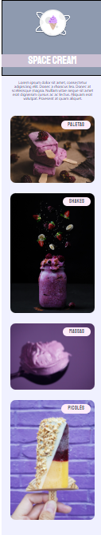

# Uso do Display Grid | Explorer Stage 3

### Essa tarefa faz parte do curso Explorer da [Rocketseat](https://www.rocketseat.com.br).

Nessa atividade foi recriado um blog com ênfase em:

- Conceitos do Display Grid;
- Uso da responsividade;
- Variáveis em CSS e cores HSL;
- Animações.

## 🔖 Layout 

## 👩‍💻 Demonstração

No seguinte link está disponível uma visualização de todo o blog em funcionamento: [Clique Aqui!](<https://www.linkedin.com/feed/update/urn:li:activity:7090164752139599872/?originTrackingId=cL62WF%2FyQpusxCpwkxSn5A%3D%3D>)
